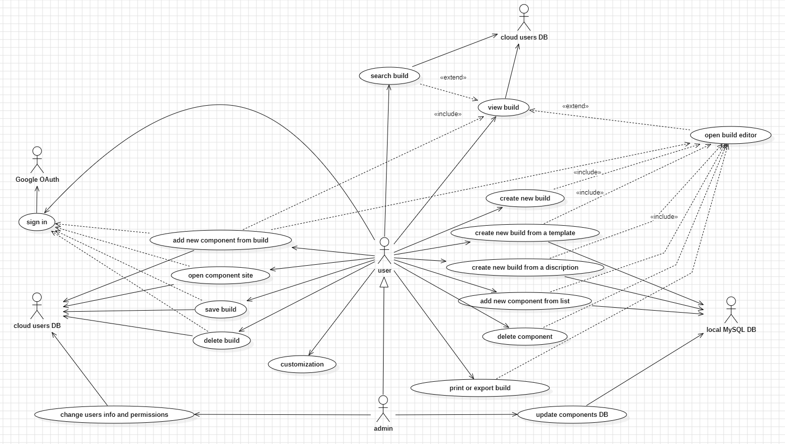
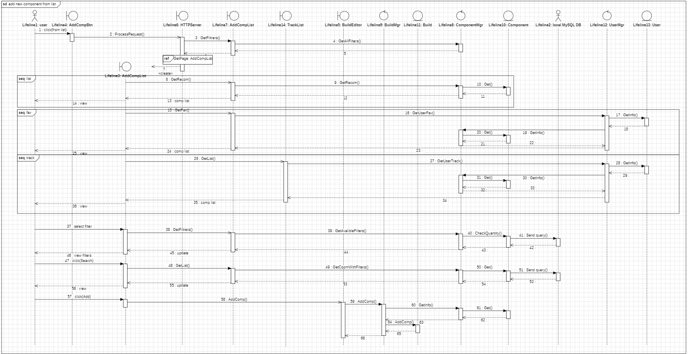
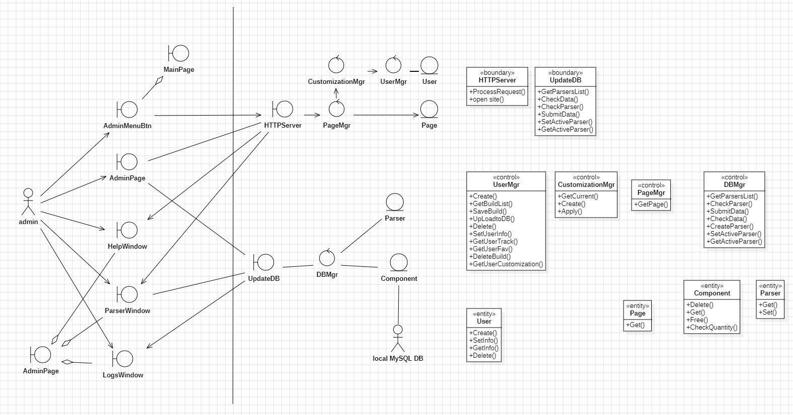
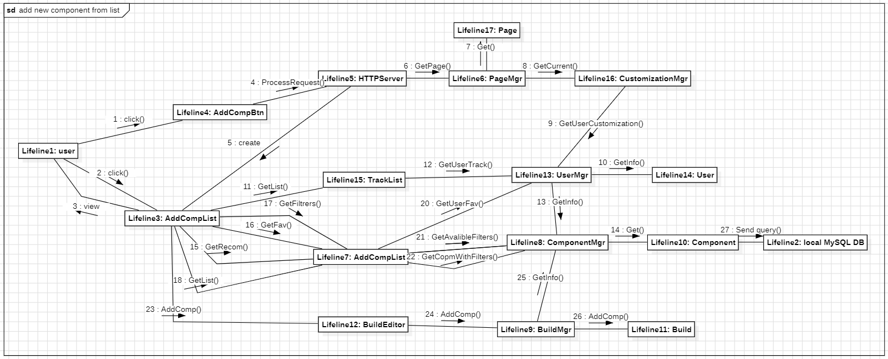
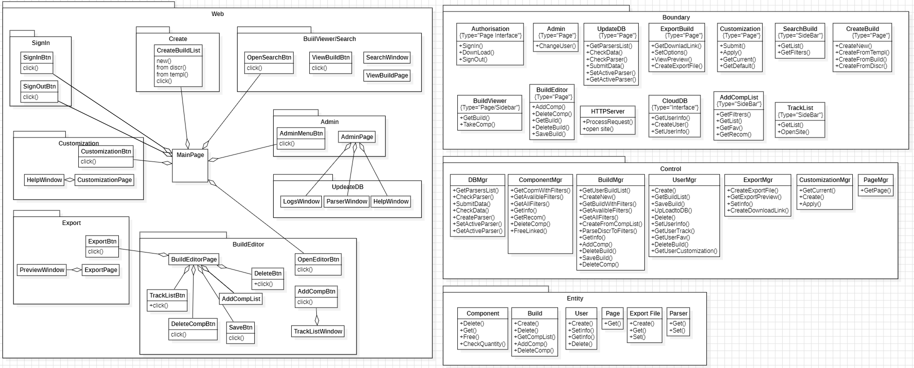

# UML Project — Component Build System

## Overview

This project presents a complete UML model of a computer build management application.  
The system is designed to help users create, manage, and export custom PC builds based on a structured database of individual components.  
The application includes user authentication, permission management, and a web interface implementing the Model-View-Controller (MVC) architectural pattern.

A separate diagram is created for each use case, supported by additional diagrams that reflect the system’s internal structure, dynamic behavior, and data model.

All diagrams follow a consistent style and are intended to demonstrate a systematic approach to software analysis and architectural design.

> Diagrams were created in **StarUML**. To view or edit the original model, please use the StarUML application.

## Examples

### Use Case Diagram

### Sequence Diagram

### Robustness Diagram

### Collaboration Diagram

### Class Diagram

---

This project demonstrates end-to-end UML modeling for a web-based system, covering both user-facing features and the internal logic behind them.